Cocos Code IDE for Intellij IDEA安装说明
=========================

简介
----------
你可以通过[这篇文章](../zh.md)了解 Cocos Code IDE 的功能。

关于IDEA平台版本适配说明
----------
从Cocos Code IDE 2.0.0beta开始都是在IDEA平台上，如果你要下载基于Ecipse平台的IDE，
请下载2.0.0之前的版本。

安装环境
---------
安装前，请先通过[这篇文章](../install-zh.md)了解需要配置的语言环境（jdk、python）和各个引擎适配的说明。

Cocos Code IDE for Intellij IDEA下载和安装
---------
请从[Cocos2dx官网下载页](http://cn.cocos2d-x.org/download/)下载Cocos Code IDE 2.0.0beta或者更高的版本。

目前提供了Windows和Mac平台的安装版本，同时，也提供了一个IDEA插件，如果你已经拥有了自己的IDEA，就可以选择使用插件的方式进行安装。特别注意，请选择IDEA 14安装插件。

###Windows和Mac平台安装
双击Windows或Mac平台的安装程序cocos-code-ide.exe、cocos-code-ide.dmg，按照向导说明即可完成安装。

###插件安装
请选择IDEA 14版本安装插件，推荐14.1

1.选择File->settings
 
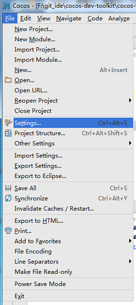

2.点击install plugin from disk

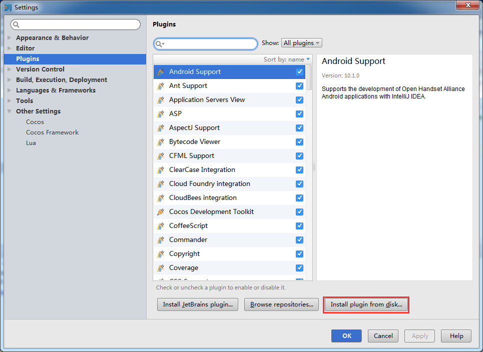

3.选择插件

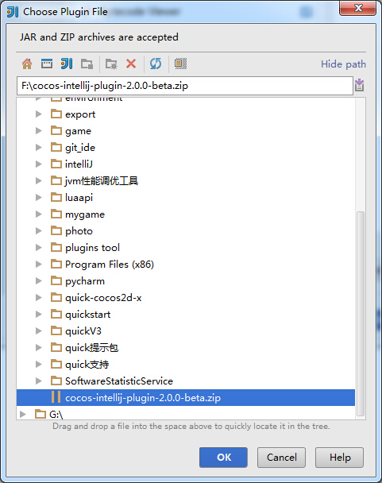

4.安装结束后，点击OK或者Apply，重启IDEA即完成安装

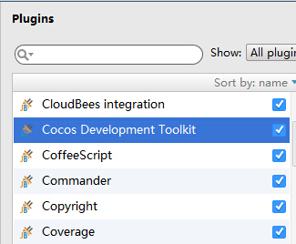

功能简介
---------
新的IDEA版本，功能上大体和原先的IDE一致，界面风格和布局基也大同小异，相同的地方不再赘述，请参看[使用文档](http://cn.cocos2d-x.org/article/index?type=code-ide&url=/doc/cocos-docs-master/manual/code-ide/zh.md)，以下将介绍IDEA上的特点。

###配置环境

1.File -> settings 

2.Other Settings -> Cocos Framework 在此处可以配置Framework或者独立引擎。Framework请在Cocos商店里下载，它包含了预编译好的js和lua引擎，如果你要用它请选择Framework Mode；如果是独立的js或者lua引擎，请选择Engine Mode。

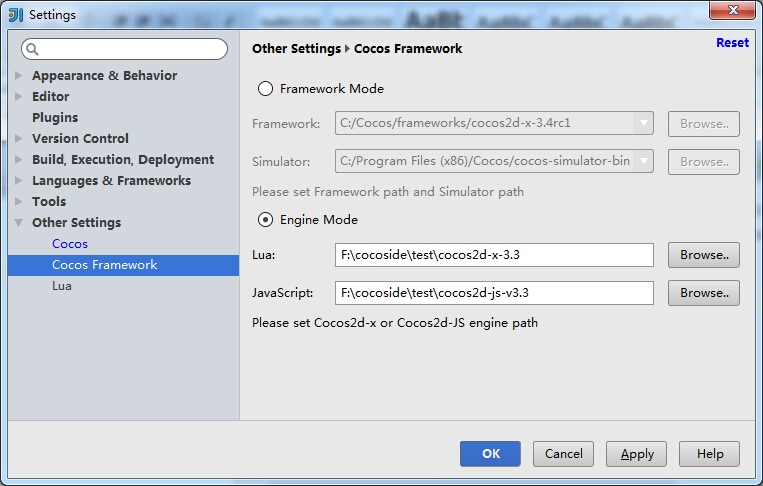

###python ndk sdk ant配置

Other Settings -> Cocos 在此处可以配置python、SDK、NDK、ANT、JDK的路径。

###新建项目

1.当你配置好引擎和设置好环境后，就可以开始新建项目了。点击File->New Project

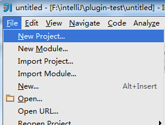

或者在IDEA的欢迎页面点击Create New Project

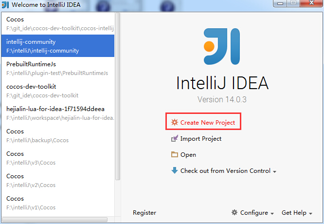

2.进入新建项目的向导,就可以选择新建Cocos JS或者Cocos Lua项目

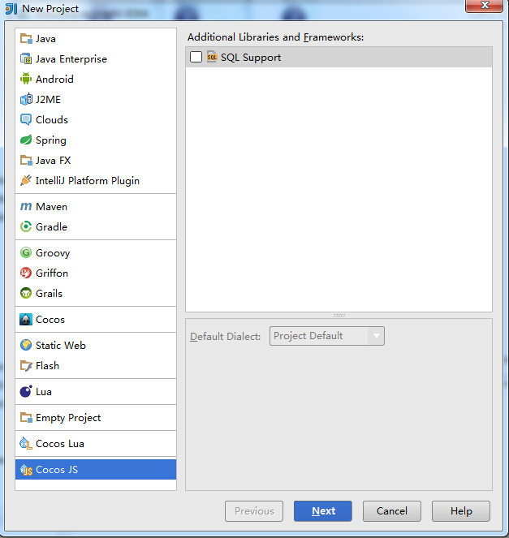

###调试

1.新建调试

方法一：项目->右键->Debug/Run 项目，会自动生成调试配置

方法二：Edit Configurations->add，选择luabiding或者jsbinding

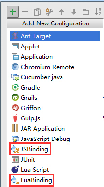

2.编辑调试配置

点击Edit Configurations

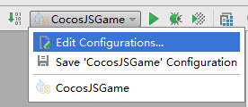

弹出调试配置页面

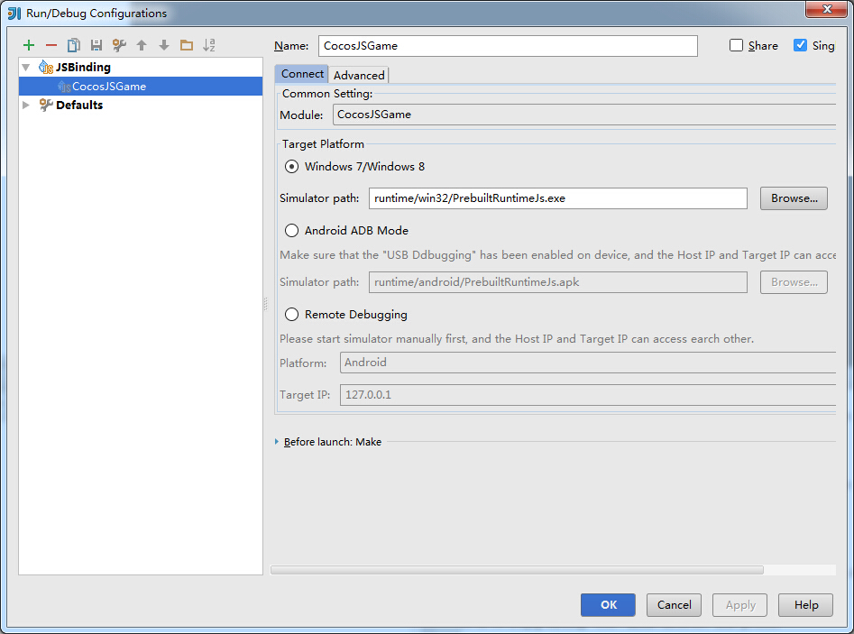

3.开始调试

方法一：项目->右键->Debug/Run 项目

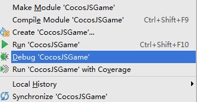

方法二：点击右上角的运行或者调试按钮

###添加源码和编译自定义模拟器

添加源码：项目->右键->Cocos Tools->Add Native Codes Support

编译自定义模拟器：项目->右键->Cocos Tools->Build Custom Simulators

入门指南
----------

* 如果你是Lua开发者，请[点击这里](getting-started-for-lua/1-creating-a-cocos-game/zh.md)。
* 如果你是JavaScript开发者，请[点击这里](getting-started-for-js/1-creating-a-cocos-game/zh.md)。

[JDK link]: http://www.oracle.com/technetwork/java/javase/downloads/index.html 
[Android SDK link]: https://developer.android.com/sdk/index.html?hl=sk
[NDK link]: https://developer.android.com/tools/sdk/ndk/
[ANT link]: http://ant.apache.org/
[Python link]: http://www.python.org/download
[cocos download page]: http://download.cocos2d-x.org
[update link]:http://www.cocos2d-x.org/filedown/cocos-code-ide-1.0.2-update.zip
