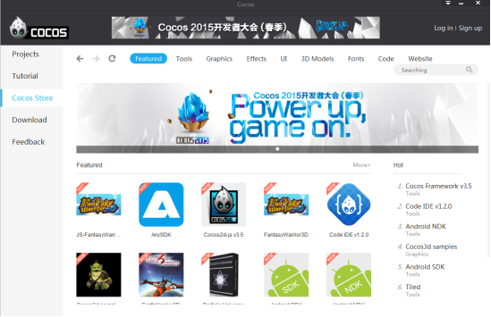
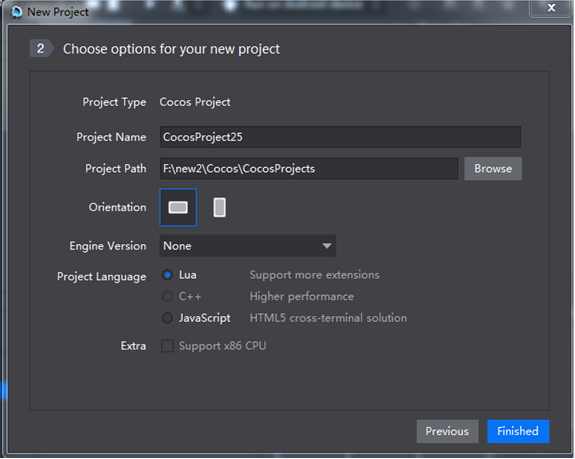
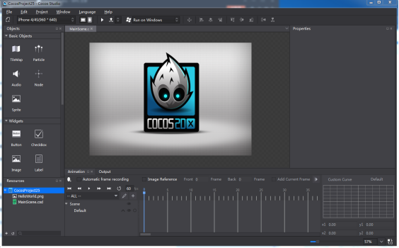

#Started on Cocos

Welcome to cocos!

Cocos is a powerful game development solution. With this suite, developers can focus on their roles and enjoy a better streamlined workflow. This saves game studios time and money by allowing them to collaborate with ease, and focus on what they do best to achieve better quality and faster turnaround time. Cocos is your best choice for developing mobile games.

###1. Overview of cocos project

 

Cocos covers functions editing resources, coding, running on real devices and packaging. 

Edit: With cocos, you can create and edit UI, 2D/ 3D scenes and animations of a game.  Cocos supports files exported from the following software: .plist file exported from TexturePacker, animation files exported from Flash, particle files exported from Particle Designer and Particle Universe, 3D models and animations from 3DMax, etc. You can download these popular tools in cocos store. As shown below,

Code: Cocos supports editing and debugging lua, js and C++ with Visual Studio, XCode and CodeIDE. Cocos Code IDE is the complete toolkit for developing, debugging, publishing Lua & JavaScript games. 
Run on real devices: You can run projects on real devices, for example mobile phones (Android, iOS), PC (Windows, Mac), and browsers, as shown below:

Package: Cocos can be widely used to build games, APP on Android, iOS, HTML5 platforms, as shown below:
 

###2. Create a cocos project

You can only create js and lua projects without Cocos Framework, which is a necessary framework to create C++ projects.  You can download Cocos Framework from Cocos Store. 

Supported scripting languages include lua, C++ and Java Script. 

Lua: based on Cocos 2d-x luabinding, it can run on Windows, Mac, Andorid, iOS.
 
C++: based on Cocos 2d-x, it can run on Windows, Mac, Android and iOS. 

JavaScript: based on Cocos 2d-jx, which includes Cocos2d-x jsbinding and Cocos2d HTML5. Interface of jsbinding is compatible with that of HTML5. Game codes can run in Cocos2d-x and HTML5 native engine. When packaging projects to Win32, Mac, iOS and Android, the default setting is JSBingding. When packaging projects to HTML5, the default setting is HTML5 engine. 

Extra functions: For Android devices, enable "support x86 architecture CPU", the android APP 

###3. Finish
Customize settings, and click "OK". A cocos project is thus created. 

Develop a “Clock” game with Cocos Studio:[http://cn.cocos2d-x.org/tutorial/show?id=2438](http://cn.cocos2d-x.org/tutorial/show?id=2438)

How to package projects with cocos:
[http://cn.cocos2d-x.org/tutorial/show?id=2419](http://cn.cocos2d-x.org/tutorial/show?id=2419)