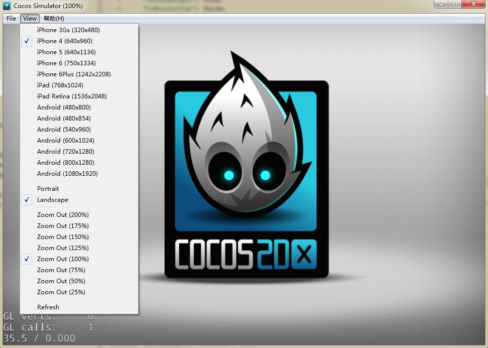

4.1 编辑游戏代码
=======

接下来就可以编写游戏逻辑了。在此之前，先来了解一下新工程自带的示例代码的逻辑。

-------------------

1. 工程目录下有一个名字为config.json的配置文件，可以在Code IDE中双击打开。配置中"entry"字段设置了游戏的入口文件为"src/main.lua"。 

        {
            "init_cfg": {
            ...
            "entry": "src/main.lua",
            ...
            },
            ...
        }
  
2. 双击打开"src"目录下的"main.lua"文件，里面主要定义了"main"函数，然后在文件最后开始执行"main"函数，开始游戏执行。
3. 在"main"函数中主要的步骤是：通过函数"setDesignResolutionSize"设置游戏设计分辨率和屏幕适配模式；然后构建一个"GameScene"对象，通过"Director"运行此对象。  

        local function main()
            ...
            cc.Director:getInstance():getOpenGLView():setDesignResolutionSize(480, 320, 0)
            local scene = require("GameScene")
            local gameScene = scene.create()
            ...
            cc.Director:getInstance():runWithScene(gameScene)
            ...
        end
        local status, msg = xpcall(main, __G__TRACKBACK__)    --run the main function
        
4. "GameScene"是在"src/GameScene.lua"文件中定义的。在此文件中，使用[cocos2d-x引擎的API]构建了一个"Scene"，其中添加了两个"Layer"，详见工程代码。
5. 可以在模拟器的菜单中选择不同的分辨率，查看游戏在不同分辨率的屏幕上的表现效果。模拟器的窗口初始大小是在config.json中配置的。  
  
5. Code IDE为代码编写提供了方便的cocos2d-x引擎API自动提示功能，只要在代码中输入相应的前缀或单词就可以看到相关的API和函数说明，不过如果代码中有语法错误的话，可能会因为语法树构建失败而无法正确提示。  
  
6. 此外，编写游戏需要添加一些图片等做为显示图像的资源，只要把需要的图片拖动到工程管理界面的某个目录下就会复制一份图片到此目录下。而且Code IDE提供了资源路径自动提示功能，方便在代码中输入资源路径。  
  

-----------------
关于如何使用引擎API的更多资料可以在引擎的相关文档中找到，在此不再多述。

在编写完一段逻辑后，需要[《调试游戏代码》](../debugging/zh.md)，验证一下代码的效果正确与否。

